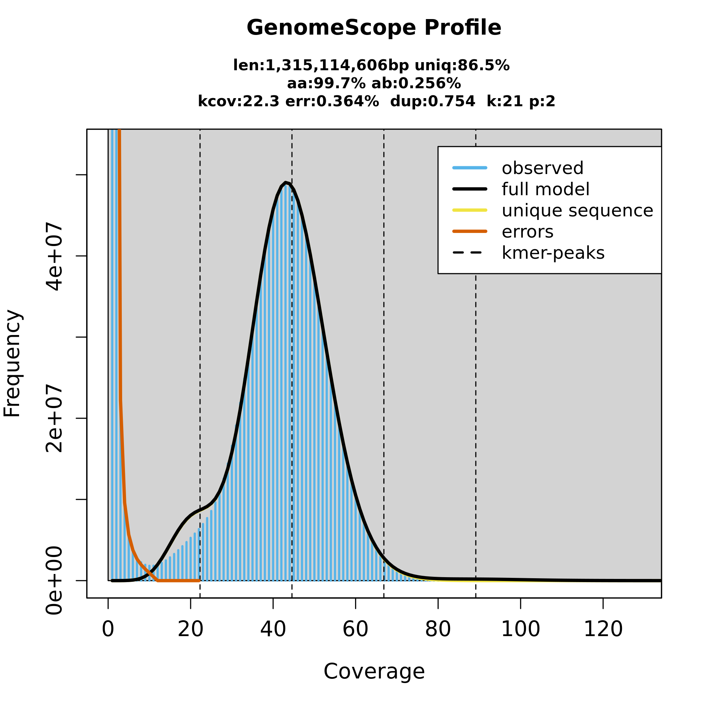
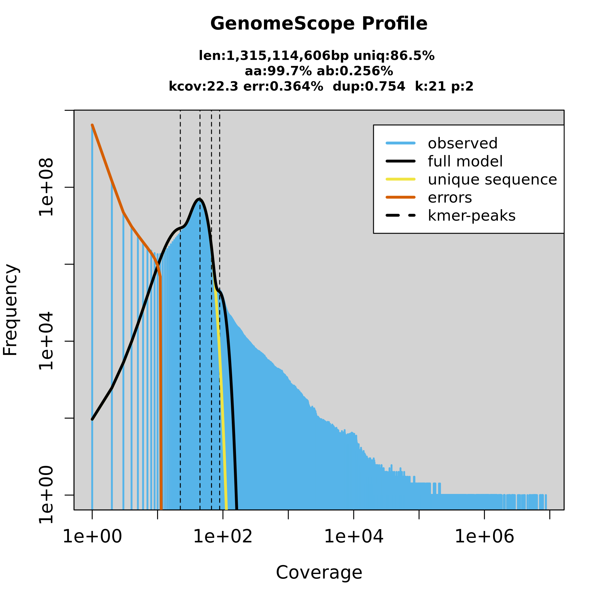
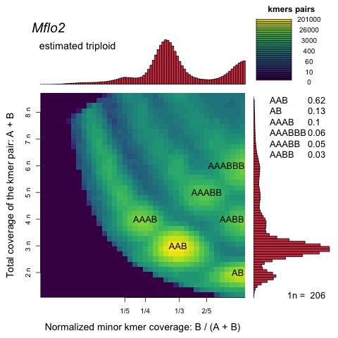

### 1) Species Data

| ToLID            | mEleMax1        |
| :--------------- | :-------------- |
| Species          | Elephas maximus |
| Class            | Mammalia        |
| Exp. Genome size |                 |
| Exp. Chromosomes | 27+X+Y          |
| GoaT             | [link](https://goat.genomehubs.org/record?recordId=9783&result=taxon&taxonomy=ncbi#Elephas%20maximus) |
| Biosample        | [link](https://www.ebi.ac.uk/ena/browser/view/SAMN10973763) |

> **Observations:**
```
None
```

---

### 2) Data Profile

| Data           | Total reads (M) | Length (b) | Extra info |
| -------------- | --------------- | ---------- | --- |
| HiFi           | 11.2            | 16000      | [multiQC](data/rCarCar2.HiFi_trimmed_multiqc_report.html) |
|                |                 |            |     |
| ONT            | NA              |            |     |
| Illumina PE    | NA              |            |     |
|                |                 |            |     |
| HiC: Arima     | 906.6           | 150        | [multiQC](data/rCarCar2.OmniC_multiqc_report.html) |
|                |                 |            |     |
| Other: Bionano |                 |            |     |


```
Tools employed: FastQC v0.11.9; Cutadapt v3.5; Fastp v0.23.2; MultiQC v1.11; SeqKit v2.3.0
```

> **Observations:** Samples obtained from frozen fibroblast cell pellets (-80C) from a deceased male adult Asian elephant (indicus)

---

### 3) Genome Profiling

| Estimation     | Value | Plot                    |
|:-------------- | ----- |:----------------------- |
| Size           |       |  |
| Heterozygosity |       |   |
| Ploidy         |       |     |

> **Observations:**
```
None
```

---

### 4) Contigging/Purging

| ID                    | Total Mb |    GC | Scaf | Cont | Gaps | Gaps Mb | Longest Scaf | Scaf N50 | Scaff L50 | Scaf N95 | Scaf L95 | Longest Cont | Cont N50 | Cont L50 | Cont N95 | Cont L95 | QV (HiFi) | QV (Illumina) | Kmer Compl | KCompl both | BUSCO-C | BUSCO-S | Hap                                  | both Hap                             | shared                               | HiC Contact map |
|:--------------------- | --------:| -----:| ----:| ----:| ----:| ------- | ------------:| --------:| ---------:| --------:| --------:| ------------:| --------:| --------:| --------:| --------:| ---------:| ------------- | ----------:| ----------- | -------:| -------:| ------------------------------------ | ------------------------------------ | ------------------------------------ | --------------- |
| mEleMax1.Hifiasm_hap1 |  2208.78 | 44.12 |   76 |  143 |   67 | 1.46    |       356.32 |   137.47 |         5 |    20.35 |       22 |       210.28 |   121.38 |        8 |     6.16 |       41 |     68.19 |               |      96.65 | 99.40       |    97.2 |    96.4 |  |  |  |        NA         |
| mEleMax1.Hifiasm_hap2 |  2214.74 |  44.1 |   71 |  127 |   56 | 5.11    |       381.26 |   137.61 |         5 |    20.31 |       22 |       209.92 |   121.92 |        8 |     6.54 |       32 |     68.42 |               |      96.66 | -           |    97.2 |    96.3 |  |                                      |                                      |      NA           |
|                       |          |       |      |      |      |         |              |          |           |          |          |              |          |          |          |          |           |               |            |             |         |         |                                      |                                      |                                      |                 |
| mEleMax1.purged_hap1  |  2208.78 | 44.12 |   76 |  143 |   67 | 1.46    |       356.32 |   137.47 |         5 |    20.35 |       22 |       210.28 |   121.38 |        8 |     6.16 |       41 |     68.19 |               |      96.65 | 99.40       |    97.2 |    96.4 |  |  |  |         NA        |
| mEleMax1.purged_hap2  |  2214.74 |  44.1 |   71 |  127 |   56 | 5.11    |       381.26 |   137.61 |         5 |    20.31 |       22 |       209.92 |   121.92 |        8 |     6.54 |       32 |     68.42 |               |      96.66 | -           |    97.2 |    96.3 |  |                                      |                                      |         NA        |

> **Observations:**
```
None
```

---

### 5) Scaffolding

| ID                    | Total Mb |    GC | Scaf | Cont | Gaps | Gaps Mb | Longest Scaf | Scaf N50 | Scaff L50 | Scaf N95 | Scaf L95 | Longest Cont | Cont N50 | Cont L50 | Cont N95 | Cont L95 | QV (HiFi) | QV (Illumina) | Kmer Compl | KCompl both | BUSCO-C | BUSCO-S | Hap                                  | both Hap                             | shared                               | HiC Contact map |
|:--------------------- | --------:| -----:| ----:| ----:| ----:| ------- | ------------:| --------:| ---------:| --------:| --------:| ------------:| --------:| --------:| --------:| --------:| ---------:| ------------- | ----------:| ----------- | -------:| -------:| ------------------------------------ | ------------------------------------ | ------------------------------------ | --------------- |
| mEleMax1.Bionano_hap1 |  2208.78 | 44.12 |   76 |  143 |   67 | 1.46    |       356.32 |   137.47 |         5 |    20.35 |       22 |       210.28 |   121.38 |        8 |     6.16 |       41 |     68.19 |               |      96.65 | 99.40       |    97.2 |    96.4 |  |  |  |                 |
| mEleMax1.Bionano_hap2 |  2214.74 |  44.1 |   71 |  127 |   56 | 5.11    |       381.26 |   137.61 |         5 |    20.31 |       22 |       209.92 |   121.92 |        8 |     6.54 |       32 |     68.42 |               |      96.66 | -           |    97.2 |    96.3 |  |                                      |                                      |                 |
|                       |          |       |      |      |      |         |              |          |           |          |          |              |          |          |          |          |           |               |            |             |         |         |                                      |                                      |                                      |                 |
mEleMax1.YaHS_hap1    |  2208.78 | 44.12 |   76 |  143 |   67 | 1.46    |       356.32 |   137.47 |         5 |    20.35 |       22 |       210.28 |   121.38 |        8 |     6.16 |       41 |     68.19 |               |      96.65 | 99.40       |    97.2 |    96.4 |  |  |  |                 |
| mEleMax1.YaHS_hap2    |  2214.74 |  44.1 |   71 |  127 |   56 | 5.11    |       381.26 |   137.61 |         5 |    20.31 |       22 |       209.92 |   121.92 |        8 |     6.54 |       32 |     68.42 |               |      96.66 | -           |    97.2 |    96.3 |  |                                      |                                      |                 |


> **Observations:**
```
None
```

---

### *) Checklist

| Data       | Y/N | Comments |
| ---------- | --- | -------- |
| HiFi ≥ 25x |     |          |
| N50 ~15 kb |     |          |
|            |     |          |
| ONT ≥ 60x  |     |          |
| N50 ~30 kb |     |          |
|            |     |          |
| HiC ≥ 50x  |     |          |


| Final assembly metrics | Y/N | Comments |
| ---------------------- | --- | -------- |
| Contig N50 > 1 Mb      |     |          |
| Scaffold N50 > 10 Mb   |     |          |
| Kmer completness > 90% |     |          |
| QV > 40                |     |          |
| BUSCO single > 90%     |     |          |
| BUSCO duplicated < 5%  |     |          |

---

# EAR 👂

### Responsible:
### bla 
### bla


